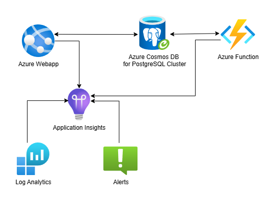

# Azure Room Reservation System

Aplikacja do rezerwacji pomieszczeń w danym budynku (np. w hotelu), napisana przy użyciu TypeScript oraz React Router.

## Stos technologiczny

- TypeScript
- React Router - główna aplikacja
- Vitest - testy jednostkowe

## Infrastruktura aplikacji

Infrastruktura aplikacji została utworzona z wykorzystaniem narzędzi Azure.

### Główne elementy aplikacji

- **Azure Webapp** - aplikacja do tworzenia rezerwacji na dane pokoje,
- **Azure Cosmos DB for PostgreSQL** - baza danych,
- **Azure Function** - zawiera funkcję odpowiedzialną za wysyłanie powiadomień e-mail do użytkowników, których rezerwacja przypada na dany dzień. Funkcja jest uruchamiana codziennie o godzinie 9:00 rano.

### Monitoring

W aplikacji wykorzystano następujące elementy monitoringu:

- **Application Insights** - obserwowanie i monitoring aplikacji
- **Metryki** - biznesowe z działania aplikacji
- **Alerty** - informowanie o zwiększonym ruchu na stronie

## Budowanie i wdrożenie aplikacji

Proces budowania aplikacji odbywa się poprzez GitHub Actions (plik **.github/workflows/deploy.yml**) i jest złożony z dwóch procesów:

- **Build and test** - w trakcie tego procesu instalowane są pakiety niezbędne do uruchomienia aplikacji, następnie przeprowadzane są testy jednostkowe. Jeśli testy zakończą się pomyślnie, następuje zbudowanie aplikacji.
- **Deploy to Azure Webapp** - proces ten odpowiada za wdrożenie zbudowanej w poprzednim kroku aplikacji do Azure Webapp

## Funkcjonalności biznesowe aplikacji

### Użytkownik niezalogowany

- Logowanie
- Rejestracja

### Użytkownik zalogowany

- Wybór pokoju
- Wybór terminu rezerwacji na dany pokój
- Tworzenie rezerwacji
- Zmiana terminu rezerwacji
- Odwołanie (usuwanie) rezerwacji
- Wylogowanie się z serwisu
